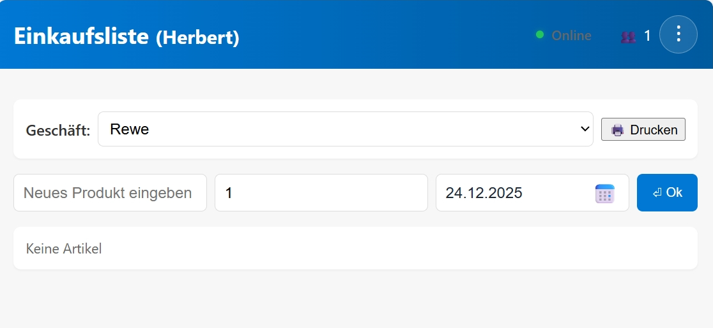
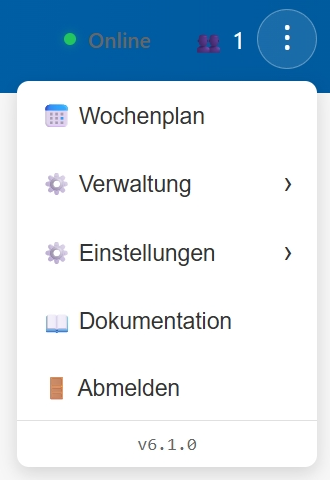

# Client/Server Einkaufsliste

Eine moderne Shopping-List-Anwendung mit sicherer Benutzerauthentifizierung, persistenter Datenspeicherung, Mengenangaben und vollständig getesteter API.

Python FastAPI Server + TypeScript Client mit JWT-Authentifizierung.

## Was ist das Ziel dieser Anwendung?

1. Meine Rezepte verwalte ich in einer App [My Recipe Box](https://www.myrecipebox.app/de/) sowohl auf Android als auch auf dem Ipad. Diese App kann die Rezepte auf einem Gerät in meinem Netzwerk speichern.
2. Wir planen unsere Essen eine Woche im Voraus und kaufen 2-mal je Woche ein.
3. Ich möchte die Rezepte aus der App in dem Wochenplan wiederfinden und die Zutaten in der Einkaufsliste.
4. Wir haben mehrere Stamm-Geschäfte in denen wir regelmäßig einkaufen und ich möchte die Einkaufsliste so aufbereitet haben, dass sie die Zutaten auf dem Weg durch das jeweilige Geschäft in der richtigen Reihenfolge darstellt.
5. Der Wochenplan und die Einkaufsliste sollen <b>ausgedruckt</b> werden.

## Releases

Eine Liste der Releases finden Sie in [RELEASES.md](docs/RELEASES.md).

## Features

Eine vollständige Liste aller Features finden Sie in [FEATURES.md](docs/FEATURES.md).

## Schnellstart

Eine Schnellstartanleitung finden Sie in [QUICKSTART.md](docs/QUICKSTART.md).

## Benutzung

Nach dem Aufruf der Seite in einem Browser Ihrer Wahl auf einem Tablet oder PC mit z.B. http://192.168.0.22:8000 (die IP-Adresse ihres Servers) landen Sie auf der Login-Seite. Nach dem Einloggen sind sie in der Einkaufsliste.

### Navigation im Benutzermenü

Das Benutzermenü (⋮) im Header der Anwendung ist hierarchisch organisiert:

**[🗓️ Wochenplan](#wochenplan-nutzen)**: Wochenplan erstellen und pflegen

**⚙️ Verwaltung** (Administration)
- **🏪 Geschäfte verwalten**: Geschäfte und Abteilungen erstellen, bearbeiten und sortieren
- **📦 Produkte verwalten**: Produkte in Geschäften verwalten
- **📋 Vorlagen**: Einkaufslisten-Vorlagen erstellen und bearbeiten
- **📏 Einheiten**: Maßeinheiten für Zutaten verwalten (Sortierung, Hinzufügen, Löschen)
- **👥 Benutzer verwalten**: Benutzer freigeben und verwalten (Admin-Funktion)

**⚙️ Einstellungen** (Settings)
- **🔌 WebSocket de/aktivieren**: Live-Synchronisation zwischen Geräten ein/ausschalten
- **🗓️ Vor Datum löschen**: löscht Daten aus der Einkaufsliste vor Datum
- **💾 Datenbank-Backup**: Datenbank sichern und wiederherstellen
- **☁️ Rezepte einlesen**: Zugriff auf Rezepte konfigurieren und importieren

**📖 Dokumentation**: Öffnet ein neues Fenster im Browser mit dieser README.md

**🚪Abmelden**: Alle Verbindungen werden geschlossen und Sie landen wieder auf der Login-Seite.

Darunter sehen Sie die aktuelle Versionsnummer.

### Einkaufsliste verwenden

Nach dem Login können Sie die Einkaufsliste verwenden:

1. **Automatische Geschäfts-Auswahl**: Das erste Geschäft wird automatisch ausgewählt
2. **Produkte hinzufügen**: Geben Sie den Produktnamen ein (z.B. "Möhren")
3. **Automatisches Matching**: Das System findet automatisch das passende Produkt im Katalog
4. **Abteilungs-Gruppierung**: Produkte werden automatisch nach Abteilungen gruppiert angezeigt
5. **Items entfernen**: Klicken Sie auf das Papierkorb-Icon (🗑️) neben dem Produkt
6. **Produktkatalog erweitern**: Produkte in "Sonstiges" können dem Produkte-Katalog hinzugefügt werden
   - Klicken Sie auf das Bearbeiten-Icon (✏️) neben einem Produkt in "Sonstiges"
   - Wählen Sie eine Abteilung aus dem Dialog
   - Das Produkt wird automatisch dem Katalog hinzugefügt
7. **Falsche Zuordnung**: Produkte, die falsch zugeordnet werden, können im Produkte-Katalog korrigiert werden.

### Rezepte verwenden

1. **WebDAV-Einstellungen konfigurieren** (einmalig):
   - Klicken Sie auf das Menü (⋮) im Header
   - Wählen Sie **"☁️ Rezepte einlesen"**
   - Erstellen Sie eine neue WebDAV-Konfiguration mit Ihren Nextcloud-Zugangsdaten
   - Geben Sie den Pfad zur recipes.json an (z.B. `/remote.php/dav/files/USERNAME/Recipes/recipes.json`)

2. **Rezepte einlesen**:
   - In den WebDAV-Einstellungen, klicken Sie auf **"📥 Rezepte einlesen"**
   - **Echtzeit-Fortschrittsanzeige** zeigt den Import-Status:
     - Download der ZIP-Datei vom WebDAV-Server
     - Extrahieren der Rezept-Dateien
     - Verarbeitung jeder Datei (~400 Rezepte pro Datei)
     - Fortschrittsbalken mit Prozentanzeige und Rezept-Zähler
     - Speichern in die Datenbank
   - Erfolgsmeldung zeigt Anzahl importierter Rezepte
   - Bei langsamen Servern kann der Import bis zu 30 Sekunden dauern

3. **Rezepte im Wochenplan verwenden**:
   - Gehen Sie zum **"🗓️ Wochenplan"**
   - Geben Sie Rezeptname in ein Essensfeld ein
   - Rezepte erscheinen in Autocomplete-Vorschlägen (nach Vorlagen)
   - Wählen Sie ein Rezept aus

4. **Rezeptdetails und Anpassungen**:
   - Klicken Sie auf den Rezeptnamen im Wochenplan
   - Modal zeigt alle Zutaten mit Mengen
   - **Personenanzahl anpassen**: Eingabefeld ändert alle Mengen proportional
   - **Zutaten deaktivieren**: Checkboxen zum Abwählen nicht benötigter Items
   - **Zusätzliche Items**: Fügen Sie eigene Zutaten hinzu
   - Alle Änderungen werden automatisch in der Einkaufsliste übernommen

5. **Automatische Einkaufsliste**:
   - Rezeptzutaten werden automatisch zur Einkaufsliste hinzugefügt
   - Mengen werden basierend auf Personenanzahl berechnet
   - Passende Einkaufstage werden automatisch zugewiesen
   - Items werden mit bestehenden Einträgen intelligent zusammengeführt (siehe unten)

### Intelligentes Item-Matching

Die Anwendung verwendet eine **intelligente Matching-Strategie** beim Hinzufügen von Items zur Einkaufsliste:

**Wie funktioniert es?**
- **Item existiert in der Produktliste**: Verwendet **Exact Match** (exakte Übereinstimmung)
  - Verhindert ungewolltes Zusammenführen ähnlicher aber unterschiedlicher Produkte
  - Beispiel: "Kürbiskerne" wird NICHT mit "Kürbiskernöl" zusammengeführt

- **Item existiert NICHT in der Produktliste**: Verwendet **Fuzzy Match** (ca. 80% Ähnlichkeit)
  - Ermöglicht flexibles Zusammenführen bei Tippfehlern oder Variationen
  - Beispiel: "Möhre" wird mit "Möhren" zusammengeführt

**Konsistentes Verhalten überall:**

Diese intelligente Strategie wird einheitlich angewendet bei:
- ✅ Manuelles Hinzufügen von Items (Eingabefeld in der Einkaufsliste)
- ✅ Rezepte aus dem Wochenplan
- ✅ Vorlagen/Templates, die im Wochenplan verwendet werden

**Vorteile:**
- **Keine ungewollten Vermischungen** bei Produkten aus dem Katalog
- **Flexible Zusammenführung** bei freien Texteingaben
- **Einheitliches Verhalten** egal wie Items hinzugefügt werden

> **Für Entwickler:** Die technische Implementierung finden Sie in `server/src/routers/items.py` (`_find_item_by_match_strategy()`).
> Details zum Refactoring in [COMPLEXITY.md](docs/COMPLEXITY.md).

### Geschäfte und Produkte verwalten

**Geschäfte und Abteilungen verwalten:**
1. Klicken Sie auf das Menü (⋮) im Header
2. Wählen Sie **"🏪 Geschäfte verwalten"**
3. Erstellen, bearbeiten oder löschen Sie Stores und Departments
4. **Geschäftsreihenfolge ändern**: Nutzen Sie die ↑↓ Buttons im Store-Header
5. **Abteilungsreihenfolge ändern**: Nutzen Sie die ↑↓ Buttons neben jeder Abteilung

**Produkte verwalten:**
1. Klicken Sie auf das Menü (⋮) im Header
2. Wählen Sie **"📦 Produkte verwalten"**
3. Wählen Sie ein Geschäft aus dem Dropdown
4. Erstellen, bearbeiten oder löschen Sie Produkte
5. **Herstellerbezeichnung hinzufügen** (optional):
   - Beim Erstellen/Bearbeiten eines Produkts: Feld "Produktbezeichnung" ausfüllen
   - Beispiel: Produkt "Brötchen" → Herstellerbezeichnung "Harry's Dinkelkrüstchen"
   - Diese Bezeichnung erscheint auf der gedruckten Einkaufsliste

**Einheiten verwalten:**
1. Klicken Sie auf das Menü (⋮) im Header
2. Wählen Sie **"📏 Einheiten"**
3. **Reihenfolge ändern**: Nutzen Sie Drag & Drop oder die ↑↓ Buttons
4. **Neue Einheit**: Geben Sie den Namen ein und klicken Sie auf "Hinzufügen"
5. **Einheit bearbeiten**: Klicken Sie auf das Bearbeiten-Icon (✏️)
6. **Einheit löschen**: Klicken Sie auf das Löschen-Icon (🗑️)
7. Änderungen werden automatisch an alle verbundenen Clients übertragen (WebSocket)

### Vorlagen verwenden

1. Klicken Sie auf das Menü (⋮) im Header
2. Wählen Sie **"📋 Vorlagen"**
3. Erstellen Sie Vorlagen mit wiederkehrenden Einkaufslisten-Items
   - **Name**: z.B. "Pasta Carbonara"
   - **Beschreibung** (optional): Details zum Rezept
   - **Personenanzahl**: Für wie viele Personen ist die Vorlage gedacht? (Standard: 2)
   - **Artikel**: Fügen Sie Artikel mit Mengenangaben hinzu
4. In der Shopping-Liste: Geben Sie den Vorlagen-Namen ein → alle Items werden automatisch hinzugefügt
5. Im Wochenplan: Vorlage als Eintrag verwenden → Mengen können für andere Personenanzahl angepasst werden

### Wochenplan nutzen

1. Klicken Sie auf das Menü (⋮) im Header
2. Wählen Sie **"🗓️ Wochenplan"**
3. Fügen Sie Mahlzeiten für die Woche hinzu
   - Sie können nur Texte in den Wochenplan einfügen, indem sie die Eingabe mit ⏎ Enter abschliessen, dann werden keine Zutaten in die Einkaufsliste hinzugefügt
   - Ansonsten nutzen Sie das erscheinende Auswahlfeld für Vorlagen oder Rezepte
4. Bei Vorlagen-Namen: Zutaten werden automatisch zur Einkaufsliste hinzugefügt
5. Bei Rezept-Namen: Zutaten werden automatisch zur Einkaufsliste hinzugefügt
6. Navigation zwischen Wochen mit Vor/Zurück-Buttons

### WebSocket aktivieren (für Live-Updates)

1. Klicken Sie auf das Menü (⋮) im Header
2. Wählen Sie **"Einstellungen"** → **"🔌 WebSocket aktivieren"** (ist standardmäßig aktiv)
3. Alle Änderungen werden jetzt live auf allen verbundenen Geräten synchronisiert

### Datenbank-Backup erstellen

1. Klicken Sie auf das Menü (⋮) im Header
2. Wählen Sie **"Einstellungen"** → **"💾 Datenbank-Backup"**
3. Laden Sie das Backup als JSON-Datei herunter
4. Für Wiederherstellung: Backup-Datei hochladen auf der gleichen Seite

## Authentifizierung

Die Anwendung verwendet **JWT (JSON Web Tokens)** für sichere Authentifizierung:

### Registrierung und Login

1. **Registrierung**: Besuchen Sie http://localhost:8000/ und erstellen Sie einen Account
   - Benutzername, E-Mail und Passwort eingeben
   - Passwörter werden mit bcrypt sicher gehasht
   - Passwortlänge: 6-72 Zeichen
   - Neue Benutzer müssen von einem Administrator freigegeben werden

2. **Login**: Melden Sie sich mit Ihren Zugangsdaten an
   - Bei erfolgreicher Anmeldung erhalten Sie einen JWT-Token
   - Token wird automatisch im localStorage gespeichert
   - Token ist 30 Minuten gültig (konfigurierbar in `.env`)

3. **Automatisches Token-Refresh**: Bei jedem API-Aufruf wird das Token automatisch erneuert
   - Dies verlängert die Token-Gültigkeit bei jeder Aktivität
   - Kein Timeout bei aktiver Nutzung

4. **Inaktivitäts-Logout**: Nach Ablauf der Token-Gültigkeit bei Inaktivität werden Sie automatisch abgemeldet

### Account-Verwaltung

- Klicken Sie auf das **Drei-Punkte-Menü** (⋮) in der rechten oberen Ecke
- **Abmelden**: Wählen Sie "Abmelden" um sich auszuloggen (Token wird gelöscht)
- **Account löschen**: Gehen Sie zu "👥 Benutzer verwalten" → "Eigenen Account löschen" (nur für Nicht-Administratoren)

### Sicherheitshinweise

- **Ändern Sie `SECRET_KEY` in Produktion**: Der Standard-Wert ist nur für Development geeignet
- **Sichere Passwörter**: Verwenden Sie starke Passwörter mit mindestens 8 Zeichen
- **HTTPS in Produktion**: Verwenden Sie einen Reverse-Proxy (nginx, Apache) mit SSL/TLS-Zertifikaten
- **Firewall**: Beschränken Sie den Zugriff auf Port 8000 auf vertrauenswürdige Netzwerke

## Für Entwickler

Technische Dokumentation, Architektur-Details, API-Endpunkte, Testing und Entwickler-Workflows finden Sie in der [DEVELOPER.md](docs/DEVELOPER.md).

Inhalte:
- Detaillierte Projektstruktur
- Installation & Entwicklungsumgebung
- API-Endpunkte Dokumentation
- Code-Qualität (Black, Flake8)
- Testing (pytest, jest)
- Continuous Integration
- Architektur (Server & Client)
- Troubleshooting

## Lizenz

Dieses Projekt ist Open Source. Siehe LICENSE-Datei für Details.

## 📚 Dokumentation

**📖 [Vollständiger Dokumentations-Index](docs/INDEX.md)** - Übersicht aller verfügbaren Dokumentationen

### Schnellzugriff

**Für Benutzer:**
- 🚀 [QUICKSTART.md](docs/QUICKSTART.md) - Schnellstartanleitung
- ✨ [FEATURES.md](docs/FEATURES.md) - Vollständige Feature-Liste
- 📋 [RELEASES.md](docs/RELEASES.md) - Release-Liste

**Für Entwickler:**
- 👨‍💻 [DEVELOPER.md](docs/DEVELOPER.md) - Technische Dokumentation (Server)
- 🗄️ [server/DATABASE_SCHEMA.md](docs/server/DATABASE_SCHEMA.md) - Datenbank-Schema
- 📊 [COMPLEXITY.md](docs/COMPLEXITY.md) - Code-Qualität und Komplexitätsanalyse (Python)
- 🏷️ [VERSIONING.md](docs/VERSIONING.md) - Release-Workflow und Semantic Versioning
- 💻 [client/ARCHITECTURE.md](docs/client/ARCHITECTURE.md) - Client 4-Schichten-Architektur
- 🔄 [client/STATE_LAYER.md](docs/client/STATE_LAYER.md) - State Management (TypeScript)
- 🐳 [DOCKER.md](docs/DOCKER.md) - Docker Deployment
- 🔌 [WEBSOCKET-DEBUG.md](docs/WEBSOCKET-DEBUG.md) - WebSocket Debugging

**Externe Ressourcen:**
- [FastAPI Dokumentation](https://fastapi.tiangolo.com/)
- [TypeScript Handbook](https://www.typescriptlang.org/docs/)
